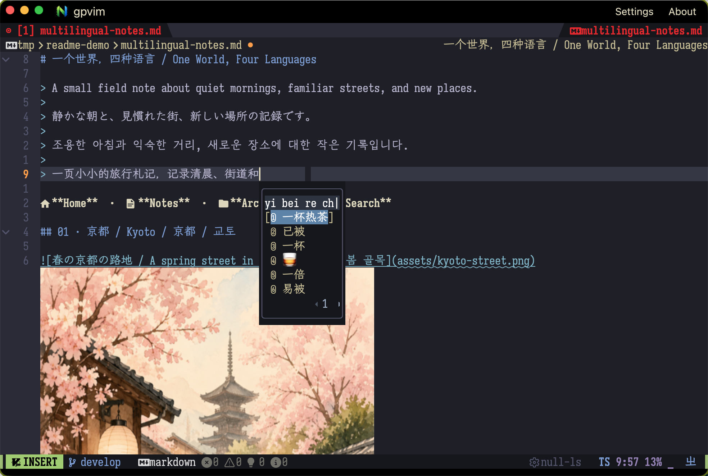
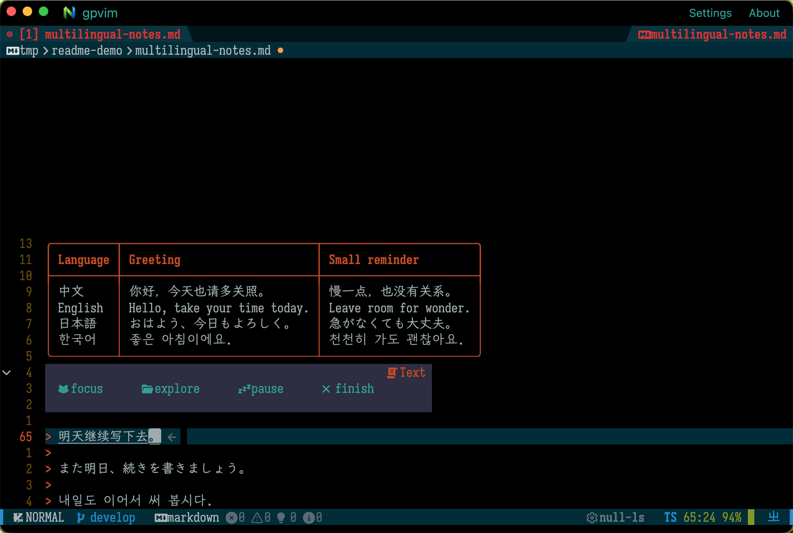
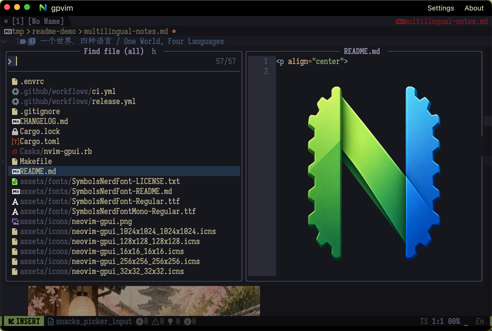

<p align="center">
  
</p>

<h1 align="center">nvim-gpui</h1>

Another GPU-rendered Neovim client for a native, cross-platform desktop
experience.

`nvim-gpui` brings Neovim's editing engine, configuration, and plugin ecosystem
to a focused desktop application. Built with GPUI, it renders Neovim's linegrid
and multigrid UI directly instead of embedding a terminal, while integrating
with the host platform for input methods, clipboard, file opening, drag and
drop, and images.

The core editing workflow is ready for everyday use. Neovim remains the
editor engine; nvim-gpui focuses on rendering, native input, and desktop
integration. Advanced protocol and plugin-specific integrations continue to
evolve as the project grows.

macOS is currently the most mature platform. Release packages are also
available for Linux and Windows, with platform-specific validation and
integration continuing across all three targets.

<p align="center">
  
  
  
</p>

See [CHANGELOG.md](CHANGELOG.md) for release history.

## Features

- Native linegrid and multigrid rendering, including floating windows.
- Embedded Neovim sessions and connections to an already-running Neovim.
- Compatibility with the versioned UI payloads used by Neovim 0.10, 0.11, and
  0.12+.
- Unicode, CJK, wide-character, and grapheme-aware text rendering.
- Bundled Nerd Font support and configurable `guifont`/`guifontwide` handling.
- Kitty image support for plugins such as `snacks.nvim`.
- System IME support and a built-in Rime input method with a private runtime on
  macOS and Windows, plus system librime support on Linux.
- Local and remote clipboard integration through Neovim's paste and provider
  APIs.
- Native file opening, Open With integration, and drag and drop across desktop
  platforms.

## Neovim requirement

nvim-gpui requires Neovim **0.10.0 or newer**. This requirement applies to
both embedded sessions and `--connect` targets. The client adapts the
versioned multigrid UI payloads used by Neovim 0.10, 0.11, and 0.12+.

## Quick start

### macOS

The easiest way to install both Neovim and nvim-gpui is Homebrew:

```sh
brew install neovim
brew tap imkerberos/nvim-gpui https://github.com/imkerberos/nvim-gpui.git
brew install --cask imkerberos/nvim-gpui/nvim-gpui
gpvim
```

You can also download the DMG for your Mac from the [latest
release](https://github.com/imkerberos/nvim-gpui/releases/latest), open it,
and drag `nvim-gpui.app` to `/Applications`. Neovim must be installed
separately and must be version 0.10.0 or newer.

Current macOS builds are unsigned. If macOS reports that the downloaded
application is damaged or cannot be verified, only do the following for an
application downloaded from a source you trust:

```sh
xattr -dr com.apple.quarantine /Applications/nvim-gpui.app
open /Applications/nvim-gpui.app
```

Replace the path if you installed the application elsewhere.

The AppBundle is available in Finder's Open With menu for source and text
files. Opening a file there sends it to the embedded Neovim session, including
when nvim-gpui is already running.

To launch the installed application directly from a terminal:

```sh
open -a nvim-gpui
```

### Debian/Ubuntu

Download the `.deb` package matching your CPU architecture, install Neovim,
then install nvim-gpui:

- [ARM64 `.deb`](https://github.com/imkerberos/nvim-gpui/releases/latest/download/nvim-gpui-latest-debian-aarch64.deb)
- [X86_64 `.deb`](https://github.com/imkerberos/nvim-gpui/releases/latest/download/nvim-gpui-latest-debian-x86_64.deb)

```sh
sudo apt update
sudo apt install neovim
nvim --version                 # must be 0.10.0 or newer
sudo apt install ./nvim-gpui-latest-debian-x86_64.deb
gpvim
```

Use the ARM64 filename for ARM64 systems. If your distribution provides an
older Neovim, install a newer version from the [official Neovim
releases](https://github.com/neovim/neovim/releases) before launching
nvim-gpui. The package installs the required Ubuntu/Debian GUI dependencies and
recommends the system Rime dependencies for the built-in Rime backend. It also
registers nvim-gpui as an Open With option for common source and text files;
the desktop entry passes selected files to the embedded Neovim session.

### Fedora

Download the RPM matching your CPU architecture, install Neovim, then install
nvim-gpui:

- [ARM64 RPM](https://github.com/imkerberos/nvim-gpui/releases/latest/download/nvim-gpui-latest-fedora-aarch64.rpm)
- [X86_64 RPM](https://github.com/imkerberos/nvim-gpui/releases/latest/download/nvim-gpui-latest-fedora-x86_64.rpm)

```sh
sudo dnf install neovim
nvim --version                 # must be 0.10.0 or newer
sudo dnf install ./nvim-gpui-latest-fedora-x86_64.rpm
gpvim
```

Use the ARM64 filename on ARM64 systems. The RPM declares the Fedora GUI,
font, graphics, and Rime runtime dependencies.

### Arch Linux

Download the x86_64 package from the [latest
release](https://github.com/imkerberos/nvim-gpui/releases/latest), install
Neovim, then install nvim-gpui:

```sh
sudo pacman -S neovim
sudo pacman -U ./nvim-gpui-latest-arch-x86_64.pkg.tar.zst
gpvim
```

The current release provides an x86_64 package. ARM64 Arch packages are not
currently provided.

### Windows

Install Neovim 0.10.0 or newer from the [official Neovim
releases](https://github.com/neovim/neovim/releases) first, and make sure
`nvim.exe` is available on `PATH`. The nvim-gpui package does not include
Neovim itself.

Download and run the [latest Windows
installer](https://github.com/imkerberos/nvim-gpui/releases/latest/download/nvim-gpui-latest-windows-x86_64-setup.exe). The
installer creates Start Menu and optional desktop shortcuts, and adds
nvim-gpui to Explorer's Open With menu for files without changing existing
default associations. It also offers to add the installed `nvim-gpui` and
`gpvim` commands to the current user's PATH. You can also download the [latest
portable ZIP](https://github.com/imkerberos/nvim-gpui/releases/latest/download/nvim-gpui-latest-windows-x86_64.zip),
extract it, and run `nvim-gpui.exe` directly.

The Windows package targets x86_64 Windows and also works on Windows 11 on
Arm through its x64 application compatibility layer.

After installation, start nvim-gpui from the application launcher or use the
command-line helper where it is available:

```sh
gpvim
```

Open a file or pass arguments to Neovim from a terminal:

```sh
gpvim README.md
gpvim --clean README.md
gpvimdiff file1 file2
```

`gpvimdiff` opens Neovim in diff mode.

## Drag and drop

In embedded mode, drag files or directories from Finder, a Linux file manager,
or Windows Explorer into the nvim-gpui window to open them in Neovim. Remote
sessions started with `--connect` accept the drop only to explain that opening
local files and directories is not supported; local paths are never sent to
the remote Neovim process.

## Release packages

Download the package matching your operating system and CPU architecture from
the [latest release](https://github.com/imkerberos/nvim-gpui/releases/latest):

| Target | ARM64 | X86_64 |
| --- | --- | --- |
|  macOS | [DMG](https://github.com/imkerberos/nvim-gpui/releases/latest/download/nvim-gpui-latest-macos-aarch64.dmg)<br>[App ZIP](https://github.com/imkerberos/nvim-gpui/releases/latest/download/nvim-gpui-latest-macos-aarch64.app.zip) | [DMG](https://github.com/imkerberos/nvim-gpui/releases/latest/download/nvim-gpui-latest-macos-x86_64.dmg)<br>[App ZIP](https://github.com/imkerberos/nvim-gpui/releases/latest/download/nvim-gpui-latest-macos-x86_64.app.zip) |
|  Ubuntu / Debian | [DEB](https://github.com/imkerberos/nvim-gpui/releases/latest/download/nvim-gpui-latest-debian-aarch64.deb) | [DEB](https://github.com/imkerberos/nvim-gpui/releases/latest/download/nvim-gpui-latest-debian-x86_64.deb) |
|  Fedora | [RPM](https://github.com/imkerberos/nvim-gpui/releases/latest/download/nvim-gpui-latest-fedora-aarch64.rpm) | [RPM](https://github.com/imkerberos/nvim-gpui/releases/latest/download/nvim-gpui-latest-fedora-x86_64.rpm) |
|  Arch Linux | — | [Package](https://github.com/imkerberos/nvim-gpui/releases/latest/download/nvim-gpui-latest-arch-x86_64.pkg.tar.zst) |
|  Windows | — | [Installer](https://github.com/imkerberos/nvim-gpui/releases/latest/download/nvim-gpui-latest-windows-x86_64-setup.exe)<br>[Portable ZIP](https://github.com/imkerberos/nvim-gpui/releases/latest/download/nvim-gpui-latest-windows-x86_64.zip) |

All links point to the latest GitHub Release. Ubuntu/Debian, Fedora, and Arch
Linux packages use the system GUI and input-method libraries; install a
compatible Neovim version separately. The Windows release is an x86_64 build
and relies on Windows 11 on Arm's x64 application compatibility layer when
used on ARM64 hardware.

## Built-in Rime input

The macOS and Windows packages include a private `librime` runtime and a
small, read-only starter data set. User dictionaries and custom schemas are
stored outside the bundle in nvim-gpui's application-support directory; the
bundled Rime data is not `~/Library/Rime`. Linux packages use the system
librime and Rime data installed through the distribution.

To enable it, open Settings → IME:

1. Select `Rime` as the input method.
2. On macOS and Windows, review the read-only librime and Rime data paths
   supplied by the application bundle.
3. Review the read-only user data directory and use `Open` when needed.
4. Click `Test`.

On Linux, the librime and Rime data fields remain configurable because the
system installation supplies those paths. The user data directory always
uses nvim-gpui's application-support directory.

Rime starts disabled even when it is selected as the backend. Press the
platform default activation shortcut (`Cmd-\` on macOS, `Ctrl-\` on Linux and
Windows) to toggle it, then enter Insert mode and type with Rime. The bundled
runtime is selected automatically when
the application is launched from the macOS AppBundle or Windows bundle; do not set
`NVIM_GPUI_RIME_LIBRARY` or `NVIM_GPUI_RIME_SHARED_DIR` when testing that
path.

## Font configuration

For reliable text and CJK alignment, set both `guifont` and `guifontwide` in
your Neovim configuration. Replace the font names with fonts installed on
your system:

```lua
vim.opt.guifont = "Iosevka Term Slab:h16"
vim.opt.guifontwide = "LXGW WenKai:h16"
```

If these options are not set, nvim-gpui uses a system monospace font as a
fallback.

## GUI-specific theme

If you use the same Neovim configuration in a terminal and in nvim-gpui, you
can select a separate theme for the GUI:

```lua
if vim.g.nvim_gpui == true then
  vim.cmd.colorscheme("your-gui-theme")
else
  vim.cmd.colorscheme("your-terminal-theme")
end
```

The equivalent environment check is:

```lua
if vim.env.NVIM_GPUI == "1" then
  vim.cmd.colorscheme("your-gui-theme")
end
```

These checks work for embedded sessions started by nvim-gpui. When using
`--connect`, Neovim has already started, so set the theme in that Neovim
session or use a `UIEnter` autocmd.

## Image previews with snacks.nvim

For image previews in an embedded Neovim session, set `SNACKS_KITTY` before
Snacks loads:

```lua
vim.env.SNACKS_KITTY = "1"

require("lazy").setup({
  {
    "folke/snacks.nvim",
    priority = 1000,
    opts = {
      image = {
        enabled = true,
        force = false,
        doc = {
          enabled = true,
          inline = true,
          float = true,
        },
      },
    },
  },
})
```

The equivalent shell command is:

```sh
SNACKS_KITTY=1 gpvim path/to/file.md
```

See [Snacks' image documentation](https://github.com/folke/snacks.nvim/blob/main/docs/image.md)
for the plugin's current options and supported document types.

## Use your existing Neovim configuration

The repository development shell uses an isolated configuration under
`config/nvim-gpui`. To launch nvim-gpui with your normal Neovim executable:

```sh
NVIM_GPUI_NVIM="$(command -v nvim)" \
  /path/to/nvim-gpui --embed
```

For a Nix-wrapped Neovim, pass the wrapper's absolute path with
`--nvim-command` or `NVIM_GPUI_NVIM`.

## Command-line options

```text
--debug-window       Show the auxiliary debug window
--no-debug-window    Hide the auxiliary debug window
--embed              Start a local embedded Neovim (default)
--connect ADDRESS    Connect to a running Neovim session
--connect-timeout SECONDS  Set the remote TCP connection timeout (default: 3)
--nvim-command PATH  Select the Neovim executable for embed mode
--cwd PATH           Set Neovim's working directory
--health-check       Report OS and graphics capabilities, then exit
--                   Pass all following arguments to Neovim
```

`ADDRESS` may be a TCP address such as `HOST:PORT`, or a Unix socket path.
`--connect-timeout` accepts a positive number of seconds, including decimals,
and applies only to remote TCP connections. Unknown arguments are passed
through to embedded Neovim.

## Clipboard

Cmd-V reads the local system clipboard and sends the text through Neovim's
`nvim_paste` API, so multiline and mode-aware paste work in both embedded and
remote sessions. The shortcut can be changed in Settings to Cmd-V, Ctrl-V, or
Disabled.

When using `--connect`, `+` and `*` register operations are bridged to the
local GUI clipboard. On Linux, `*` uses the primary selection; on other
platforms it falls back to the normal system clipboard.

## Logs

Runtime logs are written to `~/Library/Application Support/nvim-gpui/logs` on
macOS. Set `NVIM_GPUI_LOG_DIR` to use another directory. The default log
level is `off`. Choose `Off`, `Error`, `Warn`, `Info`, `Debug`, or `Trace` in
Settings → `Application behavior`. `RUST_LOG` can still override the initial level for
development, for example:

```sh
RUST_LOG=nvim_gpui=debug gpvim
```

Log files rotate at 10 MiB, with five rotated files retained.

## Update checks

Open Settings → `Application behavior` → `Updates` to check for a newer stable
release or open its download page. Automatic checks are enabled by default and
run at most once per day after startup. They do not block the editor, download
files, or send application data.

## Current limitations

The core editing and desktop integration paths are usable today. Some advanced
Neovim UI protocol details and third-party plugin features may not yet behave
exactly like they do in a terminal or in other Neovim GUI clients; these areas
continue to be developed and validated across platforms.

## License

nvim-gpui is distributed under the [MIT License](LICENSE).
