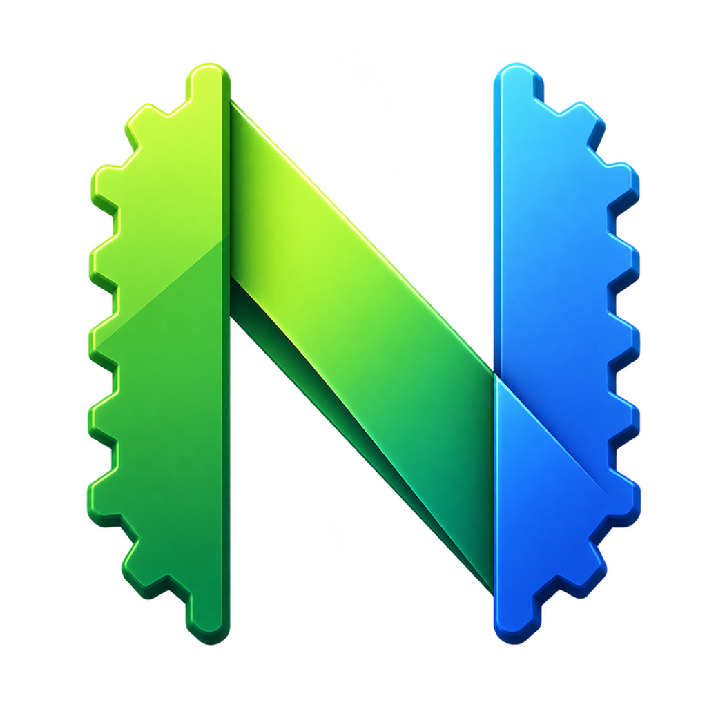

  

# nvim-gpui

A native macOS graphical frontend for Neovim.

`nvim-gpui` is experimental software. It is suitable for trying a native
Neovim editing experience, but it is not yet a complete replacement for
Neovide or a terminal UI.

See [CHANGELOG.md](CHANGELOG.md) for release history.

## Features

- Unicode and CJK text support.
- Bundled Nerd Font support.
- Image support for plugins such as `snacks.nvim`.

## Quick start

Install Neovim and nvim-gpui with Homebrew:

~~~sh
brew install neovim
brew tap imkerberos/nvim-gpui https://github.com/imkerberos/nvim-gpui.git
brew install --cask imkerberos/nvim-gpui/nvim-gpui
gpvim
~~~

Open a file or pass arguments to Neovim:

~~~sh
gpvim README.md
gpvim --clean README.md
gpvimdiff file1 file2
~~~

`gpvimdiff` opens Neovim in diff mode. To open the installed application
directly:

~~~sh
open -a nvim-gpui
~~~

## Temporary trust for unsigned builds

Current macOS builds are unsigned. macOS may therefore report that a
downloaded application is damaged or cannot be verified.

Only do this for an application downloaded from a source you trust. After
moving it to `/Applications`, run:

~~~sh
xattr -dr com.apple.quarantine /Applications/nvim-gpui.app
open /Applications/nvim-gpui.app
~~~

Replace the path if you installed the application elsewhere.

## Font configuration

For reliable text and CJK alignment, set both `guifont` and `guifontwide` in
your Neovim configuration. Replace the font names with fonts installed on
your system:

~~~lua
vim.opt.guifont = "Iosevka Term Slab:h16"
vim.opt.guifontwide = "LXGW WenKai:h16"
~~~

If these options are not set, nvim-gpui uses a system monospace font as a
fallback.

## GUI-specific theme

If you use the same Neovim configuration in a terminal and in nvim-gpui, you
can select a separate theme for the GUI:

~~~lua
if vim.g.nvim_gpui == true then
  vim.cmd.colorscheme("your-gui-theme")
else
  vim.cmd.colorscheme("your-terminal-theme")
end
~~~

The equivalent environment check is:

~~~lua
if vim.env.NVIM_GPUI == "1" then
  vim.cmd.colorscheme("your-gui-theme")
end
~~~

These checks work for embedded sessions started by nvim-gpui. When using
`--connect`, Neovim has already started, so set the theme in that Neovim
session or use a `UIEnter` autocmd.

## Image previews with snacks.nvim

For image previews in an embedded Neovim session, set `SNACKS_KITTY` before
Snacks loads:

~~~lua
vim.env.SNACKS_KITTY = "1"

require("lazy").setup({
  {
    "folke/snacks.nvim",
    priority = 1000,
    opts = {
      image = {
        enabled = true,
        force = false,
        doc = {
          enabled = true,
          inline = true,
          float = true,
        },
      },
    },
  },
})
~~~

The equivalent shell command is:

~~~sh
SNACKS_KITTY=1 gpvim path/to/file.md
~~~

See [Snacks' image documentation](https://github.com/folke/snacks.nvim/blob/main/docs/image.md)
for the plugin's current options and supported document types.

## Use your existing Neovim configuration

The repository development shell uses an isolated configuration under
`config/nvim-gpui`. To launch nvim-gpui with your normal Neovim executable:

~~~sh
NVIM_GPUI_NVIM="$(command -v nvim)" \
  /path/to/nvim-gpui --embed
~~~

For a Nix-wrapped Neovim, pass the wrapper's absolute path with
`--nvim-command` or `NVIM_GPUI_NVIM`.

## Command-line options

~~~text
--debug-window       Show the auxiliary debug window
--no-debug-window    Hide the auxiliary debug window
--embed              Start a local embedded Neovim (default)
--connect ADDRESS    Connect to a running Neovim session
--nvim-command PATH  Select the Neovim executable for embed mode
--cwd PATH           Set Neovim's working directory
--                  Pass all following arguments to Neovim
~~~

`ADDRESS` may be a TCP address such as `HOST:PORT`, or a Unix socket path.
Unknown arguments are passed through to embedded Neovim.

## Current limitations

The project is still experimental. Some advanced Neovim UI and third-party
plugin features may not yet behave exactly like they do in a terminal or in
other Neovim GUI clients.

## License

MIT.
